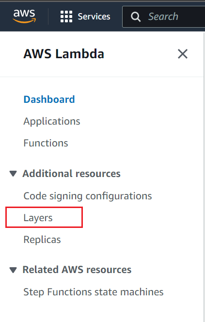
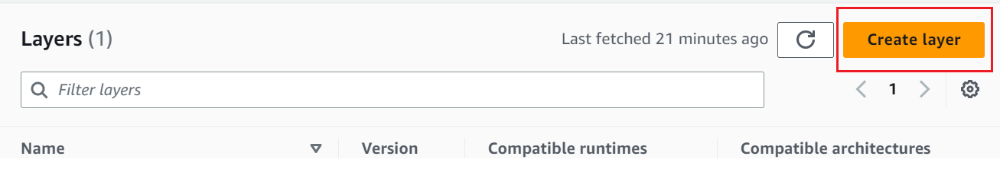
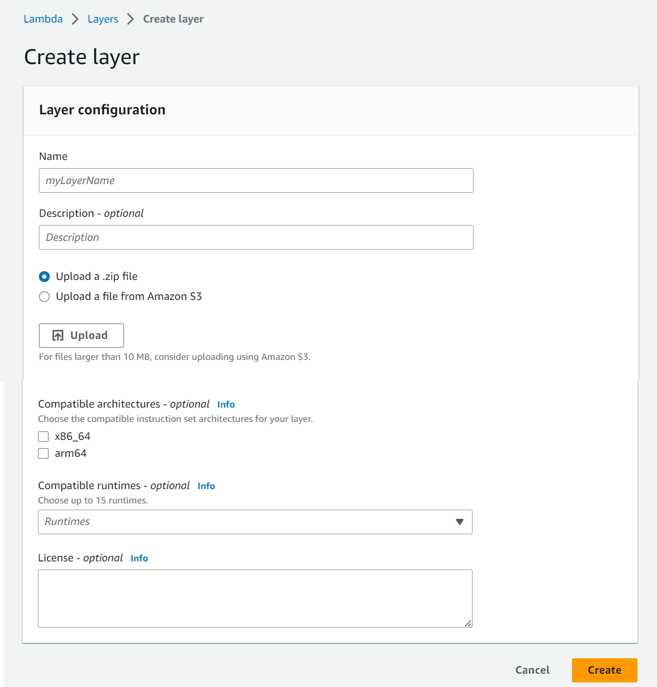
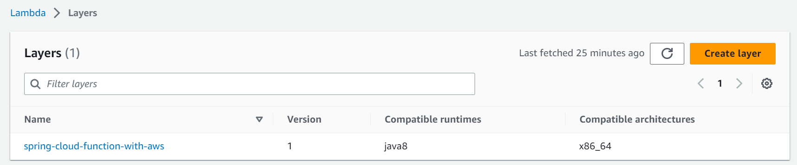
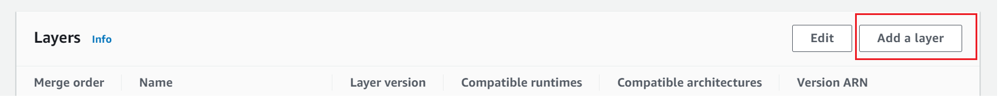
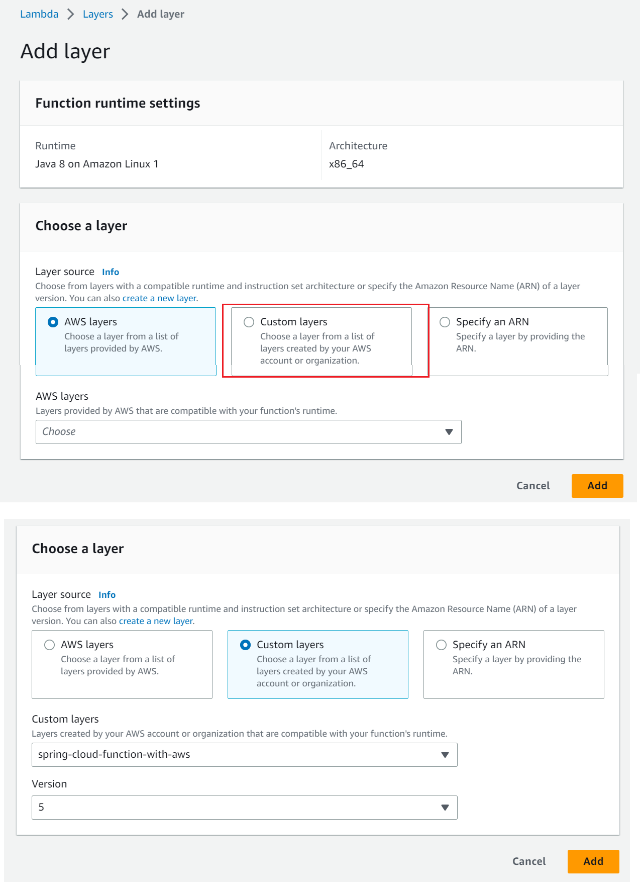

# spring-cloud-function-aws-lambda

## How to deploy thin jar into the AWS Lambda

### First create layer into the AWS the aws lambda, becase lambda offer to store common dependency and we can utilise in each and every function
- Create bundle jar and zip that bundle jar inside the java/lib folder
- e.g java/lib/bundle.jar --> zip contains java folder with sub-folder
- This zip will be uploaded into the lambda layer

---

---

---
	

---

### Now add this layer into the AWS lambda function

- Create thin jar which we will deploye into the aws lambda function and then we will add layer.

---

--

